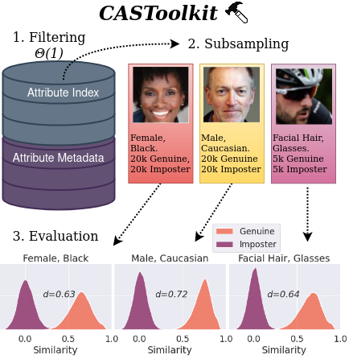
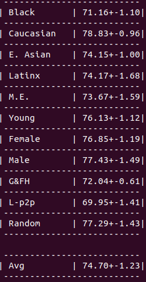

# CAST: Conditional Attribute Subsampling Toolkit
 This is a repository for conditional subsampling of datasets for training and evaluation. Over 50 pre-computed attributes for the WebFace42M dataset including race, gender, and image quality are provided. Automatic evaluation is provided for Face Recognition.

For more experimentation details see the paper [here]().

### README Contents
1. [Run CC11 Benchmark](#Run-CC11-Face-Recogntion-Benchmark)
2. [Download WebFace42M Attributes](#Download-WebFace42M-Attributes)
3. [Subsample 1:1 Verfication Sets](#Subsample-1:1-Verfication-Sets)
4. [Evaluate New Verification Sets](#Evaluate-New-Verification-Sets)
5. [Subsample Training Sets](#Subsample-Training-Sets)
6. [Acknowledgment](#Acknowledgment)


### Run CC11 Face Recogntion Benchmark
The CAST-Challenging-11 (CC11) benchmark contains 11 sub-benchmarks which contain only hard verification pairs. The full test set contains 110,000 pairs (10k per sub-benchmark) and the validation set contains 11,000 pairs (1k per sub-benchmark). See commands below to run the benchmark.

Download CC11 from [here](https://drive.google.com/file/d/1cUIcFnBwVWZq44fPpofOJXUqD37ue7c9/view?usp=sharing)(~1GB) and unzip in the `data` directory.

```
mkdir data
cd data
unzip cc11.zip

# cc11 test set
python cc11.py --weights weights_path --arch architecture
# cc11 validation set
python cc11.py --weights weights_path --arch architecture --path data/cc11_val.bin
```
Alternatively, if WebFace42M is downloaded on your system, the WebFace directory path can be passed to the script and the images will be loaded.
```
# cc11 test set with WebFace42M Pre-downloaded
python cc11.py --weights weights_path --arch architecture --path webface42m_root
```


The following architecture keys are implemented in the `models` directory: r18, r34, r50, r100, r200, mbf, mbf_large, vit_t, vit_s, vit_b. To use a different architecture, import the implementation to the model directory.

The screenshot on the right shows example output from a ResNet50 trained on WebFace4M.

### Download WebFace42M Attributes
Download the from attribute arrays from the following links. The race_gender attribute array contains 9 columns and the full attribute array contains 67 columns. Attribute arrays contain 42 million rows.

[race_gender](https://drive.google.com/file/d/1gVxGPJNgCC_ot3vfwxxWtIkY8W0YC7L_/view?usp=sharing)(1.6GB) &nbsp;&nbsp;&nbsp;&nbsp;&nbsp;&nbsp; full (available soon)

```
mkdir data
cd data
upzip race_gender.zip
```


### Subsample Verification Sets
Inside the run.py file. Pass in the desired paths for the attribute array and the paths for each row. Pass in a csv with the column names, otherwise the first row of the attribute array will be taken as the column row.

Create a list of tuples. If the data hold numerical data, create a tuple with a length of four with the first index being the attribute name, then if the data should be split using an absolute attribute value or by percentiles. Then pass in the bottom bound and upper bound for the scale defined before. Create tuples of length 2 for categorical data with the first index being the column name and the second being the class to filter for.

Now, edit the parameters of the SubsetClass declaration. The first parameter takes in the results of the filter tool and thus should not be changed. Now define the parameters for the number of validation sets, the number of matches in a set, the number of non-matches in a set, the name of the validation dataset folder, if the tool needs to filter by replacement, and the tuple list used for the filter tool.

Run the run.py file now and the result should be a folder with the sets and a description of the folder.
```
python run.py
```

### Evaluate New Verification Sets
Pass commas separated set names to run_eval.py using the --set_names flag. Directories of .list files and .bin files are retrieved from the validation_sets directory.
```
python run_eval.py --weights weights --arch architecture --sets_names set1,set2,data/set3.bin
```
The following architecture keys are implemented in the `models` directory: r18, r34, r50, r100, r200, mbf, mbf_large, vit_t, vit_s, vit_b. To use a different architecture, import the implementation to the model directory.

### Subsample Training Sets
```todo```


### Acknowledgment
The research this repository supports is based upon work supported in part by the Office of the Director of National Intelligence (ODNI), Intelligence Advanced Research Projects Activity (IARPA), via [2022-21102100003]. The views and conclusions contained herein are those of the authors and should not be interpreted as necessarily representing the official policies, either expressed or implied, of ODNI, IARPA, or the U.S. Government.

### Citation
```
@article{CAST,
  title={CAST: Conditional Attribute Subsampling Toolkit for Fine-grained Evaluation},
  authors={Robbins, Wes and Zhou, Steven and Bhatta, Aman
    and Mello, Chad and Bowyer, Kevin W. and Boult, Terrance E.},
  year={2022}
}
```
